# *Diabetes type 2 risk calculator*

Diabetes type 2 risk calculator is the terminal program in the form of questionnaire that helps to find out your risk of type 2 diabetes in the next 10 years.

It's a well-known questionnaire in different countries as the diabetes problems exist almost everywhere and you can read about this more, for example, here (in English language): [https://www.diabetes.org.uk/](https://www.diabetes.org.uk/)

When user pass through this questionnaire he/she will find out that potential risk level for developing diabetes in the next 10 years of life depending on points earned. Each answer corresponds a certain number of points. Points are not displayed to the user until the end of the questionnaire with the aim that user is being honestly. So in the end program calculates total points quantity and provides conclusion with recommendations what to do.

This program doesn't save or transfer any data users provide to aim anyone cannot
identify users due to possible sensitive data for them.

Diabetes type 2 risk calculator can be accessed by this [link](https://diabet-50dfd36a4254.herokuapp.com/)

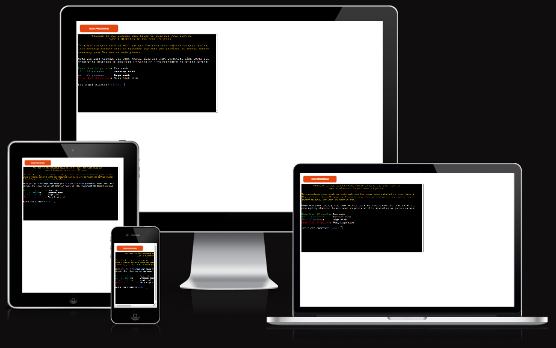

---
## User Stories

### First Time Visitor Goals:

* As a First Time Visitor, I want to quickly understand the program's primary purpose so that I can learn more what that program is about.
* As a First Time Visitor, I want to navigate through the program easily so that I can find the content.
* As a First Time Visitor, I want to find the program useful for myself so that I can fulfill my expectations.

### Returning Visitor Goals:

* As a Returning Visitor, I want to pass through the questionnaire if I didn't yet so I can start it just in one click.
* As a Returning Visitor, I want to see my final points and recommendations what to do so it's information always be there.

### Frequent Visitor Goals:

* As a Frequent User, I want to have possibility restart the program if I forgot some parameters or wasn't ready or something have changed in my life so I can restart the questionnaire.

---

## Features

+ ### When the program is loaded

    The user can see a welcoming message which describes what the program is about and the question if user wants to start the test:

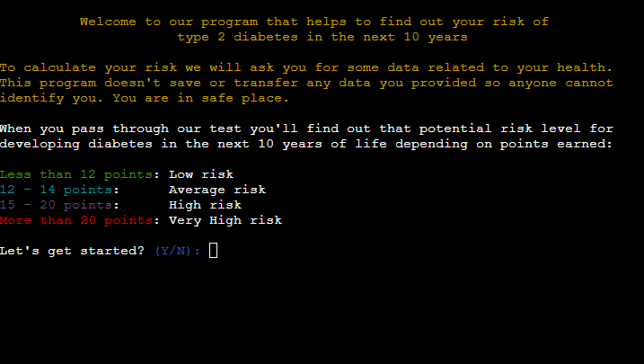

---

+ ### When the user types "n" or "N"
    
    The user can see a Goodbye message:
    
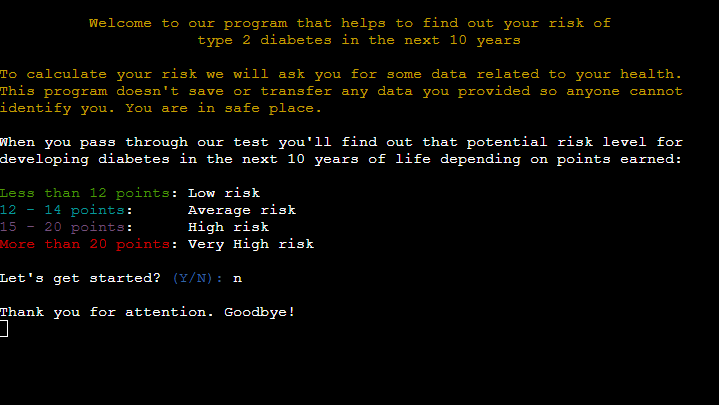

+ ### If user types "y" or "Y"

    User can see that the screen have been cleared and the first question "How old are you?" with some answer options menu navigated by cursor Up or Down displayed. Choosing options accomplished by hitting "Enter" button on the keyboard:
    
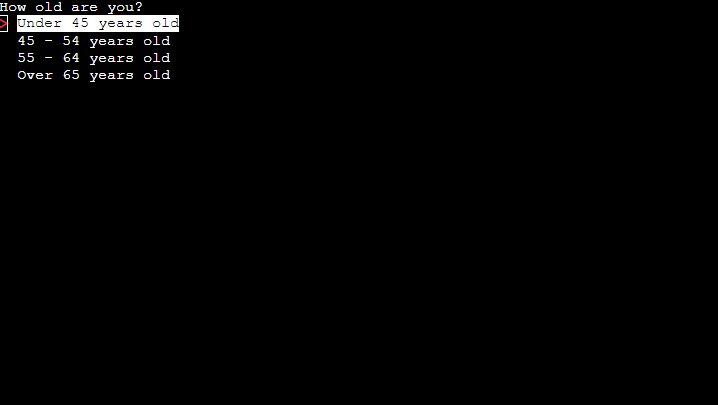

+ ### When user have answered on the first question - Second question

    User can see the result of his/her choice. Text from the chosen option is displayed. Also next question is displayed and the user have to answer with his/her gender. Choosing options accomplished by hitting "Enter" button on the keyboard as well:

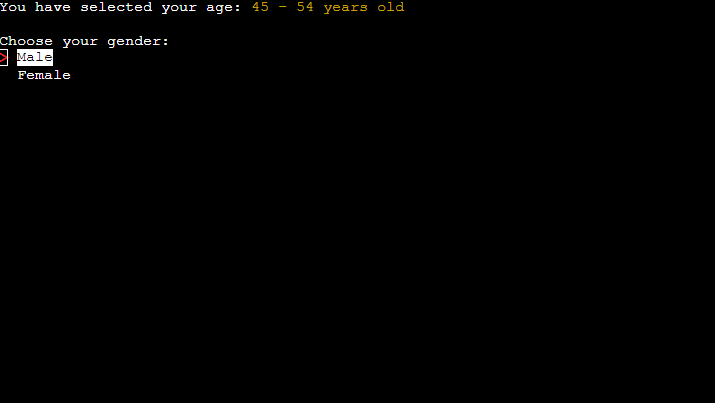

+ ### Third question

    User can see the result of his/her choice and the third question is diplayed welcoming to choose option that corresponds of the user's waist measurement. Also displayed a hint how to measure it. Displaying waist options is based on gender have chosen in the previous question. Choosing options accomplished by hitting "Enter" button on the keyboard as well:

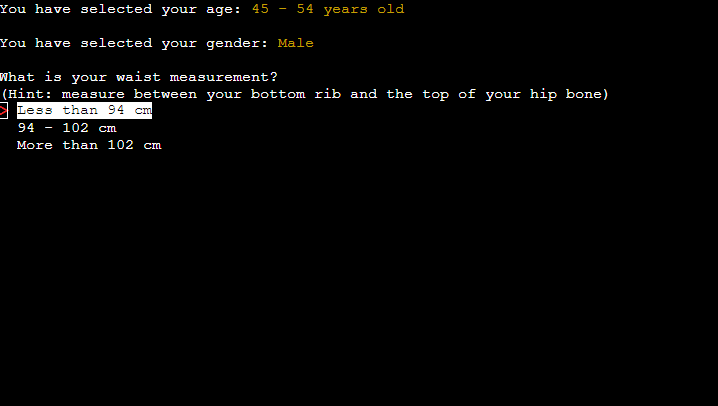

+ ### Fourth question

    During all next questions user will see the result of his/her choice from the previous questions.
    On fourth question "How tall are you in centimeters?" user have to input his/her height typing it on a keyboard with digits:

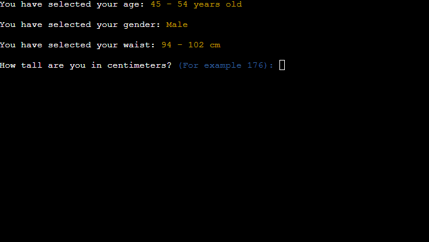

+ ### Fifth question

    On fifth question "How much do you weight in kilograms?" user have to input his/her weight typing it on a keyboard with digits:

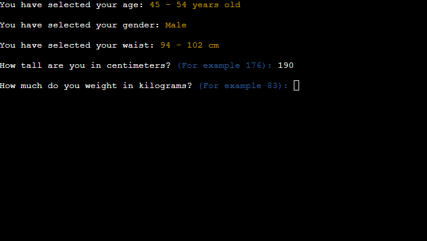

+ ### Sixth question

    *After answering on fifth question user can see calculated result of his/her BMI - Body Mass Index with the description what it is and comment if it's good, average or bad.*

    After that user can see sixth question: "How often do you eat vegetables, fruits or berries?". Answer options menu already exist as in the first three questions and it navigates by cursor Up or Down. Choosing options accomplished by hitting "Enter" button on the keyboard:

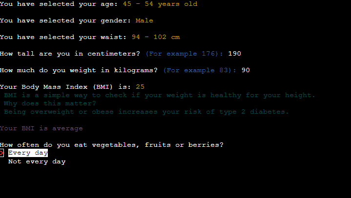

+ ### Seventh question

   Seventh question: "Do you do physical exercises? (including walking for 30 minutes every day at least 3 hours during the week)". Answer options menu already exist. Choosing options accomplished by cursor and hitting "Enter" button on the keyboard. Also in all the rest questions.

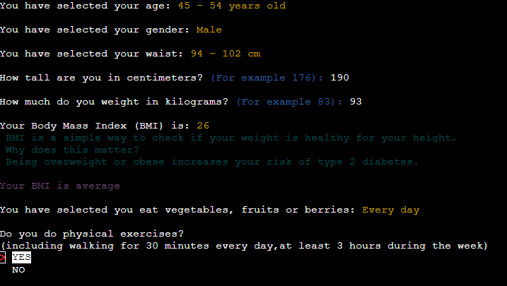

+ ### Eighth question

   Eighth question: "Have you ever taken medication to lower your blood pressure?":

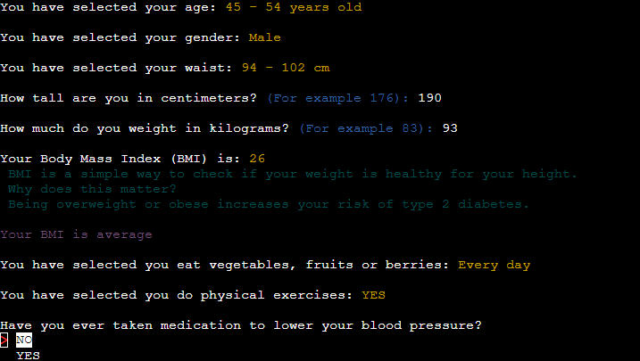

+ ### Ninth question

   Ninth question: "Have you ever had high blood sugar level? (during check-ups, illness or pregnancy)":

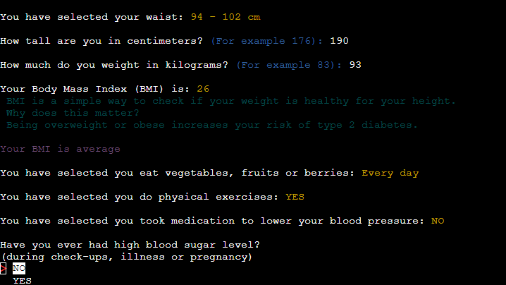

+ ### Tenth question

   Tenth question - the last one. "Did any of your relatives have type 1 or type 2 diabetes?":

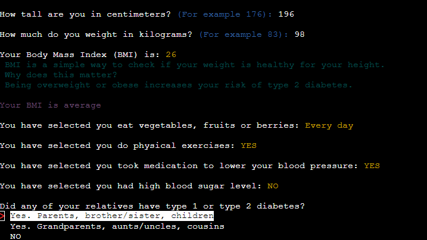

+ ### CONCLUSION

   Conclusion is based on calculated sum of points user earned answering on questions which correspond a certain number of points each. Conclusion is represented by a range of points and recommendations what user may do next in life.

   Also displayed a question either user whants to start test again or quit.

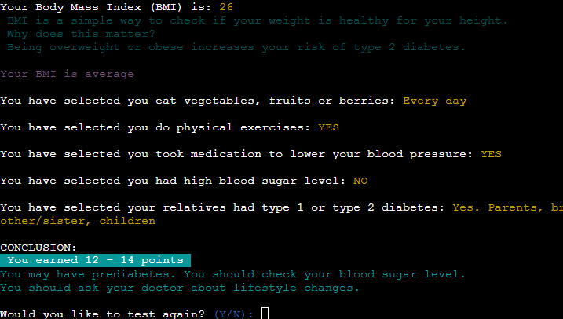

---

## Flowchart

The flowchart represents the logic of the application:

  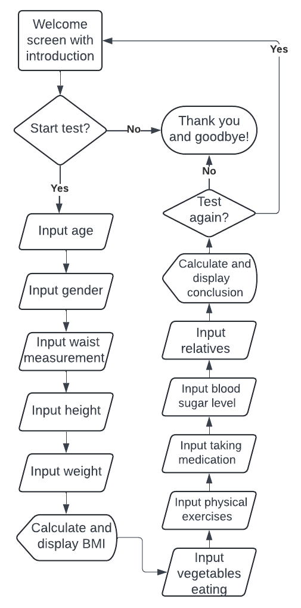

---

## Technologies Used

### Languages:

- [Python](https://www.python.org/): used as one and only the project programing language and direct all application behavior
- [JavaScript](https://www.javascript.com/): used to provide the start script needed to run the Code Institute mock terminal in the browser
- [HTML](https://developer.mozilla.org/en-US/docs/Web/HTML) used to construct the elements involved in building the Code Institute mock terminal in the browser

### Frameworks/Libraries, Programmes and Tools:

#### Python modules/packages:
##### Standard library imports:

- [os](https://docs.python.org/3/library/os.html ) - was used to clear the terminal
- [sys](https://docs.python.org/3/library/sys.html) - was used for correct exit from program

##### Third-party imports:

- [Simple Terminal Menu](https://pypi.org/project/simple-term-menu/) was used to implement the menu.
- [Colorama](https://pypi.org/project/colorama/) was used to add colors and styles to the project.

##### Own module import:

- was used import introduction() function from separate python file "introduction.py"

#### Other tools:

- [Git](https://git-scm.com/) - Git was used for version control by utilizing the Gitpod terminal to commit to Git and push to GitHub
- [GitHub](https://github.com/) - GitHub was used to store the project's code after being pushed from Git
- [Heroku](https://id.heroku.com) - Heroku was used to deploy the live project
- [Lucidchart](https://lucid.app/) - Lucidchart was used to create the flowchart
- [PEP8](https://pep8ci.herokuapp.com/) - CI Python Linter was used to validate all the Python code
- [Awesome Screenshot](chrome-extension://nlipoenfbbikpbjkfpfillcgkoblgpmj/option-react.html) - Chrome extension was used to making screenshots 

---

## Testing

Please refer to the [TESTING.md](TESTING.md) file for all test related documentation.

---
## Deployment

- The program was deployed to [Heroku](https://heroku.com).
- The program can be reached by the [link](https://diabet-50dfd36a4254.herokuapp.com/)

### To deploy the project as an application that can be **run locally**:

*Note:*
  1. This project requires you to have Python installed on your local Linux PC:
  - `sudo apt install python3`

  2. You will also need pip installed to allow the installation of modules the application uses.
  - `sudo apt install python3-pip`

Create a local copy of the GitHub repository by following one of the two processes below:

- Download ZIP file:
  1. Go to the [GitHub Repo page](https://github.com/dimmando/diabetes).
  2. Click the Code button and download the ZIP file containing the project.
  3. Extract the ZIP file to a location on your PC.

- Clone the repository:
  1. Open a folder on your computer with the terminal.
  2. Run the following command
  - `git clone https://github.com/dimmando/diabetes.git`

- Alternatively, if using Gitpod, you can click below to create your own workspace using this repository.

  

  1. Install Python module dependencies:
     
      1. Navigate to the folder diabetes by executing the command:
      - `cd diabetes`
      2. Run the command pip install -r requirements.txt
        - `pip3 install -r requirements.txt`

### To deploy the project to Heroku so it can be run as a remote web application:

Clone the repository:

  1. Open a folder on your computer with the terminal.
  2. Run the following command
  - `git clone https://github.com/dimmando/diabetes.git`
  3. Create your own GitHub repository to host the code.
  4. Run the command `git remote set-url origin <Your GitHub Repo Path>` to set the remote repository location to your repository.
  5. Push the files to your repository with the following command:
  `git push`
  6. Create a Heroku account if you don't already have one here [Heroku](https://dashboard.heroku.com).
  7. Create a new Heroku application on the following page here [New Heroku App](https://dashboard.heroku.com/apps):
  8. Choose deployment method from GitHub
  9. Link your GitHub account and connect the application to the repository you created.
  10. Go to the Settings tab:
  11. Click "Add buildpack":
  12. Add the Python and Node.js buildpacks in the exact order as written here.
  13. Click "Reveal Config Vars"
  14. Add 1 new Config Vars:
      - Key: PORT Value: 8000
      - *This Config was provided by [CODE INSTITUTE](https://codeinstitute.net/)*.
  15. Go back to the Deploy tab:
  16. Click "Deploy Branch":
      - Wait for the completion of the deployment.
  17. Click "Open app" to launch the application inside a web page.

## Future features
- future code optimization

---
## Credits

- [https://www.diabetes.org.uk/](https://www.diabetes.org.uk/) - The British Diabetic Association
- Color formatting: [Colorama](https://pypi.org/project/colorama/)
- Terminal menu: [Simple Terminal Menu](https://pypi.org/project/simple-term-menu/)
- [heroku.com](https://heroku.com/) - for hosting the application

---
## Acknowledgements

[Julia Konovalova](https://github.com/IuliiaKonovalova) - Thanks a lot to my mentor Julia Konovalova for her help and support