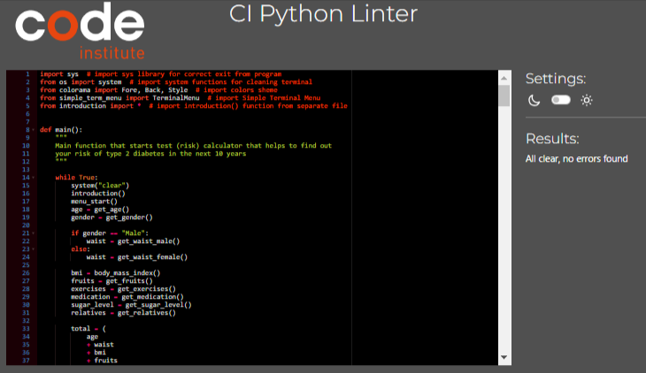
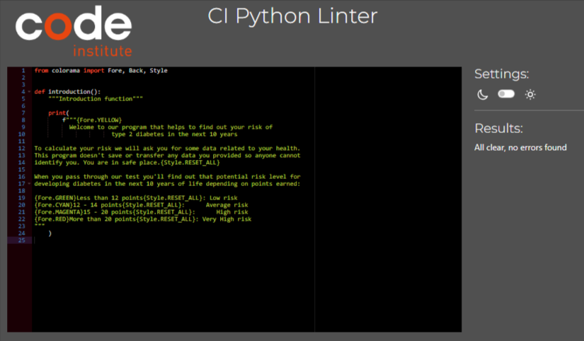
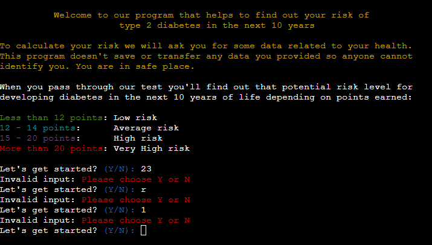
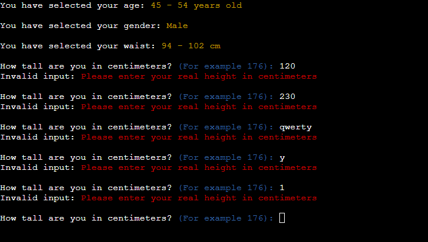
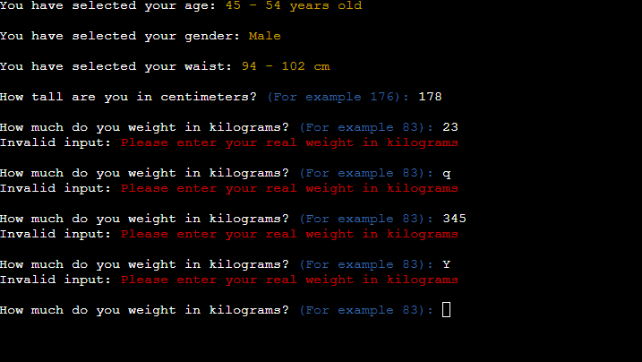
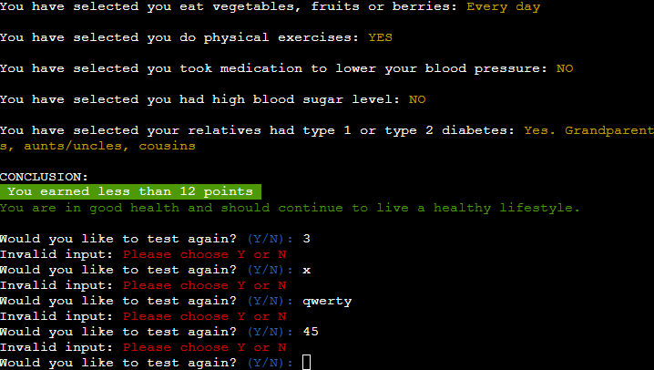

# TESTING

## Validation testing

Used PEP8 Python Validator to validate my code

+ ### Validated code of the file "run.py"
  No errors or warnings were found when passing through the PEP8 Python Validator.

  
        
+ ### Validated code of the file "introduction.py"
  No errors or warnings were found when passing through the PEP8 Python Validator.

  

---

## Testing user stories
 
User Story |  Test | Pass
--- | --- | :---:
I want to quickly understand the program's primary purpose so that I can learn more what that program is about. | I can read welcome text with the description of the program just in the center of the screen | &check;​
I want to navigate through the program easily so that I can find the content | I can easily go step by step through the test answering the questions | &check;​
I want to find the program useful for myself so that I can fulfill my expectations | The program is made for helth life style main purpose so can be intersting anyone| &check;
I want to pass through the questionnaire if I didn't yet so I can start it just in one click | I can choose and input only one button "y" to easily start the test | &check;
I want to see my final points and recommendations what to do so it's information always be there | I can easily pass through the test step by step and final points and recommendations will always be at the end despite on how to answer on questions | &check;
I want to have possibility restart the program if I forgot some parameters or wasn't ready or something have changed in my life so I can restart the questionnaire | I can easily restart the program in the end to test again. The program can work in the loop | &check;

 ### Manual Testing

 #### Welcome screen and question "Let's get started?"

Screenshot

  - I've tested that the input field for choosing "Y" or "N" takes only  letter "y", "Y", "n", "N" and nothing else and that error message is displayed to the user that warns the user of his input

 #### Check the height input 

Screenshot

   - I've tested that on prompt to user input the height only real range of height is allowed and no letters allowed. Only numbers. And that  error message is shown to the user and promt to enter real height.

 #### Check the weight input 

Screenshot

  - I've tested that on prompt to user input the weight only real range of weight is allowed and no letters allowed. Only numbers. And that  error message is shown to the user and promt to enter real weight.

 #### Conclusion screen

Screenshot

  - I've tested that the input field for choosing "Y" or "N" on conclusion screen with the question ether user wants to take test again takes only letter "y", "Y", "n", "N" and nothing else and that error message is displayed to the user that warns the user of his input.

## Bugs
+ ### Solved bugs
    Most of bugs were found during formatting, styling and coloring welcome description, questions and providing answers on questions. Also in formatting result for good UX.
    
        *Solutions:* refactoring print statements, debugging by isolating some functions, putting numbers and checking output only one function needed to correct.

+ ### Unsolved bugs
    None.

+ ### Mistakes
    No mistakes were found due to very simple math calculations.    
---